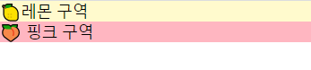

# 일반 css 적용

- button2.css가 button1.css를 **overwrite**함 <br>
😲 why?) react는 파일을 나누어서 코딩하지만 webpack을 이용해서 브라우저가 이해할 수 있도록 만들어진 HTML,JS가 한 페이지의 동일한 파일안에서 작성되어지기 때문
- 따라서 className을 좀 더 세부적으로 나눔
```js
<div className="button"> // 기존
<div className="button1"> // 변경
```
이렇게 하게 되면 번거로운 단점이 있음

# PostCSS


PostCSS를 쓰게 되면 위와 같은 번거로움을 겪지 않고 모듈화를 할 수 있음.
## 🌳 방법
- css 파일 앞에 `.module.`을 붙여줌
```
button1.css // 기존
button1.module.css // 모듈화
```
`button1.jsx`
```
import styles from './button1.css'; // 기존
import styles from './button1.css'; //변경

<div className='button'> // 기존
    <span className='text'>Button1</span>
</div>

<div className={styles.button}> // 변경
    <span className={styles.text}>Button1</span>
</div>
```
이렇게 하게 되면 오버라이팅 하지않고 각각의 css가 적용 됨.


